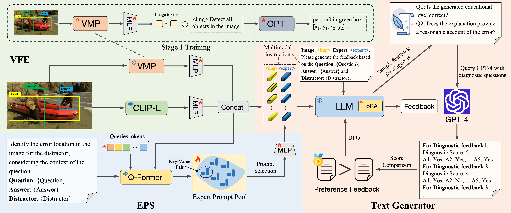

# <b>Learning to Correction</b>: Explainable Feedback Generation for Visual Commonsense Reasoning Distractor
[Jiali Chen](https://github.com/Gary-code)<sup>1</sup>, [Xusen Hei]()<sup>1</sup>, [Yuqi Xue]()<sup>1</sup>, [Yuancheng Wei](https://github.com/wyclike)<sup>1</sup>, [Jiayuan Xie](https://scholar.google.com/citations?hl=zh-CN&user=yZOXh24AAAAJ&view_op=list_works&sortby=pubdate)<sup>2</sup>, [Yi Cai](https://scholar.google.com.hk/citations?hl=zh-CN&user=ej3Nb5wAAAAJ&view_op=list_works&sortby=pubdate)<sup>*,1</sup> [Qing Li](https://scholar.google.com/citations?user=D1LEg-YAAAAJ&hl=en)<sup>2</sup>

<p><sup>1</sup>South China University of Technology &nbsp;&nbsp;<sup>2</sup>The Hong Kong Polytechnic &nbsp;&nbsp;
<br><sup>*</sup>Corresponding author &nbsp;&nbsp;
<h5 align="center">

[](https://dl.acm.org/doi/abs/10.1145/3664647.3681590)

</h5>




Overview of Pedagogical Expert Instructed Feedback Generation (PEIFG) model

## :building_construction: Run PEIFG

### Installation

1. Clone this repository and navigate to the PEIFG folder

```shell
gt clone https://github.com/Gary-code/PEIFG.git
cd PEIFG
```

2. Install Package

- Install Anaconda or Miniconda distribution based on Python3.10 from their [downloads' site](https://conda.io/docs/user-guide/install/download.html).
- Main packages: PyTorch = 1.13, transformers = 4.43

3. Download model weights:

:rocket: **Instructblip (Q-Former), Qwen1.8B, OPT-350M**

### Data Preparation

Our VCR-DF dataset reuse the images from the official VCR dataset. You can download in [VCR](https://visualcommonsense.com/).

The annotation of our VCR-DF dataset is in `./vcr_df_dataset` folder.

### Train

```shell
cd train
bash lora_train_feedback.sh
```


## 📑 Citation

```shell
@inproceedings{peifg,
  author       = {Jiali Chen and
                  Xusen Hei and
                  Yuqi Xue and
                  Yuancheng Wei and
                  Jiayuan Xie and
                  Yi Cai and
                  Qing Li},
  editor       = {Jianfei Cai and
                  Mohan S. Kankanhalli and
                  Balakrishnan Prabhakaran and
                  Susanne Boll and
                  Ramanathan Subramanian and
                  Liang Zheng and
                  Vivek K. Singh and
                  Pablo C{\'{e}}sar and
                  Lexing Xie and
                  Dong Xu},
  title        = {Learning to Correction: Explainable Feedback Generation for Visual
                  Commonsense Reasoning Distractor},
  booktitle    = {Proceedings of the 32nd {ACM} International Conference on Multimedia,
                  {MM} 2024, Melbourne, VIC, Australia, 28 October 2024 - 1 November
                  2024},
  pages        = {8209--8218},
  publisher    = {{ACM}},
  year         = {2024},
}
```

